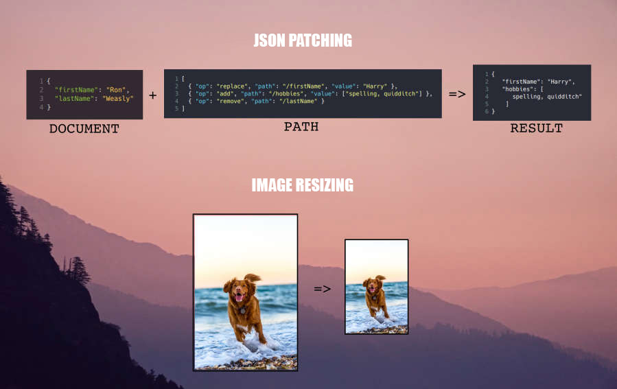

[](https://travis-ci.com/SandunWebDev/JSON-Patch-API)
[](https://codecov.io/gh/SandunWebDev/JSON-Patch-API)

# **JSON Patch API Project**

This is an Express Server API Project that provide end points for JSON Patching [(See More About That Here)](http://jsonpatch.com/) and Image Resizing.

A Live Demo API Server is @ [https://json-patch-api.herokuapp.com/](https://json-patch-api.herokuapp.com/) . Just know it takes few seconds to heroku instance to fire up for the first time.

<p align="center">
  
</p>

---

## **Project Build Dashboards**

This project use Travis CI/CD pipeline with Docker Containerization, Kubernetes and Automated Testing for Continues Deployment.

- [Travis CI/CD Builds](https://travis-ci.com/SandunWebDev/JSON-Patch-API)
- [Docker Hub Images](https://cloud.docker.com/u/sandunwebdev/repository/docker/sandunwebdev/json-patch-api-image-prod)
- [Code Coverage](https://codecov.io/gh/SandunWebDev/JSON-Patch-API)

---

## **Used Technologies**

| FrontEnd | BackEnd                  | Tools             | Other              |
| -------- | ------------------------ | ----------------- | ------------------ |
| -        | NodeJS + Express         | Jest + Supertest  | Docker + Heroku    |
|          | Passport + BCryprt + JWT | ESLint + Prettier | TravisCI + CodeCov |
|          | JSON Patch               |                   | Postman            |
|          | Sharp                    |                   |                    |
|          | Husky                    |                   |                    |

---

## **How To Run**

### # USING DOCKER

- Just run `npm run docker:dev:run`. It will install and run all the dependencies and services need to run this project. Then you can interact with the program through http://localhost:4000.
- Use `npm run docker:dev:stop` to stop Docker containers gracefully with services, and volumes and `npm run docker:dev:test` to test inside the container.
- Also already built "Docker Images" of this project can be found in [here](https://cloud.docker.com/u/sandunwebdev/repository/docker/sandunwebdev/json-patch-api-image-prod). (Remember to Pass required enviroment variable.)

### # USING NORMAL WAY

- Run `npm install` to install dependencies.
- Then run `npm start`.
- Normally you can interact with program through http://localhost:4000.

### **NOTE** : Make sure `".env"` file is filled with necessary values.

---

## **How To Test**

- `npm test` - Run full test suite with coverage. (Unit + Integration)
- `npm run test:unit` - Only run unit tests in watch mode.
- `npm run test:integration` - Only run integration tests in watch mode.
- `npm run test:watchAll` - Run all tests in watch mode.

---

## **How To Debug**

- Just run `npm run debug`.
- Then You know the rest. Happy Debugging. 😄

---

## **How To Lint**

- Using "Husky" git hooks, this app is configured to automatically takes care of "Linting/Code Formatting" with "ESLint" and "Prettier" when code commits happen.
- But If you want to run manually just run `npm run lint`.

---

## **API Usage Example**

### # **JSON Patching - /json/patch**

- URL -
  ```
  https://json-patch-api.herokuapp.com/json/patch
  ```
- REQEST BODY (POST REQEST) -

  ```
    {
      token: "123dfsd$@#$Ddfcv',
      document : { "firstName": "Ron", "lastName": "Weasly"},
      patch:  [{ "op": "replace", "path": "/firstName", "value": "Harry"},
               { "op": "add", "path": "/hobbies", "value": ["spelling, quidditch"]},
               { "op": "remove", "path": "/lastName"}]
    }
  ```

- RESPONSE BODY -

  ```
    {
      "success": true,
      "patchedDocument": {
        "firstName": "Harry",
        "hobbies": ["spelling, quidditch"]
    }
  ```

---

## **API Summery**

| Path                 | Request Type | Request Body                                                                       | Sucess Response Body                                                                      | Failure Response Body                   | Description                                                                                                                                                                      |
| -------------------- | ------------ | ---------------------------------------------------------------------------------- | ----------------------------------------------------------------------------------------- | --------------------------------------- | -------------------------------------------------------------------------------------------------------------------------------------------------------------------------------- |
| /                    | GET          | --                                                                                 | `{"success: true"}`                                                                       | `{success: false, errMsg: "ERROR_DES"}` | Root path. User get confirmation about server is alive and connection is succssful.                                                                                              |
|                      |              |                                                                                    |                                                                                           |                                         |                                                                                                                                                                                  |
| /auth/login          | POST         | `{username: "ANY_USERNAME", password:"ANY_PASSWORD"`                               | `{"success: true, token:"YOUR_TOKEN", username:"YOUR_USERNAME"}`                          | `{success: false, errMsg: "ERROR_DES"}` | By Login in here, Users can get TOKEN that need to access protectd endpoints such as "/json/patching", "/image/thumbnail", etc.. Generated token is valid for one hour.          |
| /auth/tokenValidator | POST         | `{token: "TOKEN"}`                                                                 | `{success: true, msg:"STATUS", iat:"ISSUE_DATE", exp:"EXPIRED_DATE", username:{USERNAME}` | `{success: false, errMsg: "ERROR_DES"}` | By providing existing token user can check whether its expired or not, and other details.                                                                                        |
|                      |              |                                                                                    |                                                                                           |                                         |                                                                                                                                                                                  |
| /json/patch          | POST         | `{token "VALID_TOKEN", document:"VALID_JSON_OBJECT", patch:"VALID_JSON_ARRAY"`     | `{success: true, pathcedDocument: "PATCHED_JSON_DOC"}`                                    | `{success: false, errMsg: "ERROR_DES"}` | When Valid Token, JSON Object and Array of JSON Patch opertaion provided user get Patched JSON Object according provided values. See more details [here](http://jsonpatch.com/). |
|                      |              |                                                                                    |                                                                                           |                                         |                                                                                                                                                                                  |
| /image/thumbnail     | POST         | `{token "VALID_TOKEN", imageURL:"VALID_URL", width:"WIDTH_PX", height:"HEIGHT_PX"` | { RESIZED IMAGE AS SPECIFIED }                                                            | `{success: false, errMsg: "ERROR_DES"}` | When Valid Token, ImageURL, width(Not Required - Default 50px), height(Not Required - Default 50px) provided user get rezied image as specified.                                 |

---
